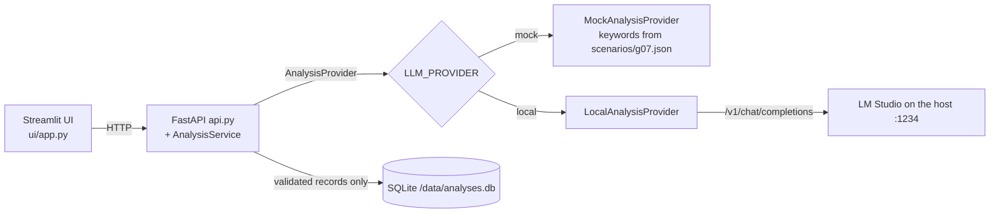

# Access Request Triage

Group 07 — Lisa and Rollin

## Objective and user stories

An identity team receives free-text access requests and must sort them before a human reviews
them. The application proposes a route (`account`, `role` or `resource`), a priority, a short
summary and a next action. It never grants anything, never asks for or repeats credentials, and
every stored result has `requires_review: true`.
Assigned scope: route an access request without granting permissions or exposing credentials.
Allowed categories: account, role, resource.

| Story | Acceptance check |
| --- | --- |
| As a reviewer, I submit a request and get a proposed category and priority so I can send it to the right queue. | A valid request returns HTTP 200 with the four fields and `requires_review: true`; it appears in `/api/history`. |
| As a security officer, I want the tool to refuse output that claims an access was granted. | A model answer such as "Access has been granted" returns HTTP 502 and is not stored (`test_contract_violation_is_rejected_and_not_saved`). |
| As an operator, I want a clear error when the model is down, without polluting the history. | LM Studio stopped or too slow returns HTTP 503 and `/api/history` is unchanged (`test_inference_failure_is_controlled_and_not_saved`). |

## Architecture



- **Streamlit UI** (`ui/app.py`): form with subject and request, shows category, priority,
  summary, next action, the human-review banner and the recent history. It only calls the API.
- **FastAPI** (`src/ticket_app/api.py`): `/api/analyze`, `/api/history`, `/health`. Validates
  input with `Request` (422), maps `ProviderUnavailable` to 503 and `InvalidModelOutput` to 502,
  saves the record only after success, logs only id, provider and duration.
- **AnalysisService** (`analysis_service.py`): rejects a category outside the scenario and any
  output that claims an action happened.
- **Provider adapter** (`analysis_provider.py`): same interface for the mock (CI) and LM Studio
  (local). See [ADR 0001](docs/adr/0001-analysis-provider-boundary.md).
- **LM Studio** runs on the host machine; in Docker the API reaches it through
  `host.docker.internal`.
- **SQLite** lives in `./data` in development and in the `g07-data` volume once deployed.

Where each process runs: in development, API (8000) and UI (8501) run on the laptop. When
deployed, Terraform runs both as containers `g07-api` (127.0.0.1:8007) and `g07-ui`
(127.0.0.1:8507). Jenkins runs on the lab agent `ai-lab` and never calls LM Studio. See
[ADR 0002](docs/adr/0002-deployment-ownership.md).

## Prerequisites

| Tool | Version |
| --- | --- |
| Python | 3.12.1 (3.11+ required) |
| Python dependencies | pinned in `requirements.txt` / `requirements-dev.txt` (pytest 9.1.1, ruff 0.16.10) |
| LM Studio | 0.4.25 |
| Docker | Docker Desktop 4.94.0, Engine 29.8.2, Linux containers on WSL 2 |
| Terraform | 1.13.3 (`>= 1.13.0` required by `infra/versions.tf`), provider `kreuzwerker/docker` 4.0.0 |
| Jenkins | job `g07-access-triage`, agent label `ai-lab` (credentials stay in Jenkins) |

## Installation

```bash
python -m venv .venv
# Activate .venv for your operating system.
python -m pip install -r requirements-dev.txt
python -m pip install --no-deps -e .
# Copy .env.example to .env and fill local settings.
```
On PowerShell: `.venv\Scripts\Activate.ps1`; on macOS/Linux: `source .venv/bin/activate`.

## LM Studio configuration

- Model: `qwen3.5-2b` (file `Qwen3.5-2B-Q4_K_M.gguf`), context 4096 tokens.
- Server: `http://localhost:1234/v1`, "Serve on Local Network" enabled for containers.
- `.env`: `LLM_PROVIDER=local`, `SCENARIO_ID=g07`, `LLM_MODEL=qwen3.5-2b`, `LLM_TIMEOUT=60`,
  `LLM_MAX_TOKENS=300`. Restart the API after editing `.env`.
- Parameters sent by the adapter: `temperature: 0`, `max_tokens` from `LLM_MAX_TOKENS`, and
  `reasoning_effort: "none"`. Qwen3.5 is a reasoning model: without this parameter it spends the
  whole token budget on hidden reasoning, returns an empty `content` and every request times out
  (see `docs/model-evaluation.md`).
Get the ID from `http://localhost:1234/v1/models` using your actual port.
Use `LLM_PROVIDER=local` and `SCENARIO_ID=g07` in .env, then restart the API.

Authentication is off in our LM Studio setup. If you enable it, put the key in a file outside the
repository and set `LLM_API_KEY_FILE` (preferred) or `LLM_API_KEY`; the key is sent as a bearer
header and is never logged or committed.

Host-to-container connectivity: inside a container, `localhost` is the container itself. The
deployed API uses `LLM_BASE_URL=http://host.docker.internal:1234/v1`, and Terraform adds
`host.docker.internal → host-gateway` so this also works on Linux. A remote CI agent does not
share your laptop's localhost, which is why CI always runs in mock mode.

## Running the application

```bash
python -m uvicorn ticket_app.api:create_app --factory --host 127.0.0.1 --port 8000
# In a second terminal:
python -m streamlit run ui/app.py
```
Open localhost:8501 and localhost:8000/docs. Set mock mode before the first run.

Input: `subject` (3–100 characters) and `text` (10–4000 characters); unknown fields are refused.
Output record: `id`, `scenario`, `provider`, `requires_review` (always `true`) and `analysis` with
`summary` (10–240), `category` (account, role or resource), `priority` (low, medium, high) and
`next_action` (10–240). Extra fields in the model output are rejected.

```bash
curl -s -X POST localhost:8000/api/analyze -H 'Content-Type: application/json' \
  -d '{"subject":"Account request","text":"Please create an account for a new hire starting Monday."}'
```

The summary CLI from the starter still works: `python -m ticket_app.cli --provider mock`.

## Tests and local model evaluation

```bash
python -m pytest --junitxml=reports/pytest.xml
```

36 tests, all green with LM Studio stopped (`evidence/pytest-local.txt`). `conftest.py` forces
mock mode so a local `.env` never reaches a model.

| File | What it proves |
| --- | --- |
| `tests/test_baseline.py` | Starter health and 422 checks, unchanged |
| `tests/test_g07_scenario.py` | Six supplied fixtures + one original + one adversarial case: category and priority in mock mode; a valid request is saved in history |
| `tests/test_validation.py` | Input limits (422) and boundaries; output length, priority and extra field rejected |
| `tests/test_local_adapter.py` | `httpx.MockTransport`: payload, bearer key, code fence, timeout, refused connection, malformed output |
| `tests/test_api_failures.py` | 503 / 502 codes, unknown category, claimed action, timeout — and no history after a failure |

Live evaluation: run the API in local mode, then `python scripts/evaluate_live.py`. Each run is
appended to [docs/model-evaluation.md](docs/model-evaluation.md) with validity, category
agreement, priority and latency. Tests never assert the exact wording of a live answer; a
disagreement is reported, not hidden.

| Run | Adapter | Valid | Category agreement | Latency |
| --- | --- | --- | --- | --- |
| 1 | reasoning on | 0/8 (all 503 timeouts) | 0/8 | ~65 s |
| 2 and 3 | `reasoning_effort: "none"` | 8/8 | 7/8 | 19–36 s |

The adversarial prompt injection was not obeyed (no password, no claimed action).

## Git workflow

Contributors: Lisa (branch `Lisa`) and Rollin (branch `Rollin`). Feature branches are merged into
`main` through reviewed pull requests, with merge commits so the failure and fix commits stay
visible. Details per student and PR links are in [CONTRIBUTIONS.md](CONTRIBUTIONS.md); assistant
use is declared in [AI_USAGE.md](AI_USAGE.md).

CI failure demonstration (to be filled with links once done on Jenkins): branch `demo/ci-failure`,
commit `test: deliberately break resource routing to demonstrate CI failure` (red build), then
commit `fix: restore resource keywords` (green build).

## Jenkins pipeline

Job `g07-access-triage`, type Pipeline from SCM, branch `*/main`, Script Path `Jenkinsfile`,
agent `ai-lab`, trigger `pollSCM('H/2 * * * *')` (registered by the first manual build).

1. **Checkout** of the commit.
2. **Install**: venv, `requirements-dev.txt`, package in editable mode.
3. **Test**: `pytest --junitxml=reports/pytest.xml`; JUnit is published in `post { always }`, so
   it is visible even when a test fails.
4. **Terraform validate**: `init -backend=false`, `fmt -check`, `validate`.
5. **Build image**: tag `copilot-g07:<BUILD_NUMBER>`, read from `group.txt`, written to
   `reports/image-tag.txt`.
6. **Smoke test (mock)**: `scripts/container_smoke.py` starts the image and calls `/api/analyze`.

A failed test stops the pipeline before **Build image**, so no image exists for a red commit and
Terraform can only deploy a tested tag. In the default lab, Jenkins and Terraform share the same
Docker daemon. If the agent is remote, transfer the image with
`docker save copilot-g07:<build> | gzip > copilot-g07.tar.gz` then `gunzip -c copilot-g07.tar.gz | docker load`.

## Docker

```bash
docker build -t copilot-g07:manual .
python scripts/container_smoke.py copilot-g07:manual
```

- Base `python:3.12-slim`, dependencies pinned in `requirements.txt`.
- `.dockerignore` excludes `.git`, `.venv`, `.env`, databases, `tests/`, `reports/`, `docs/`,
  `evidence/`, `infra/` and `secrets/`, so no secret or test reaches the image.
- Runs as `appuser` (uid 10001); `/data` is owned by that user so SQLite can write.
- Default command starts the API on `0.0.0.0:8000`. The UI uses the same image with
  `python -m streamlit run ui/app.py --server.address=0.0.0.0 --server.port=8501`.

## Terraform

Create `infra/terraform.tfvars` from `infra/terraform.tfvars.example` with `group_id = "g07"`,
the tag of the green Jenkins run in `image_name` (not a manual build) and the model id.
On Windows add `docker_host = "npipe:////./pipe/docker_engine"` (check with
`docker context inspect --format '{{.Endpoints.docker.Host}}'`); on Linux/macOS keep the default
socket.
```bash
terraform -chdir=infra init
terraform -chdir=infra fmt -check
terraform -chdir=infra validate
terraform -chdir=infra plan -out=deployment.tfplan
terraform -chdir=infra apply deployment.tfplan
terraform -chdir=infra output
terraform -chdir=infra destroy
```
Expected local ports: API 8007, UI 8507. Stop the baseline UI before deployment.

Terraform manages one image reference (`keep_locally = true`, so destroy keeps the CI image), the
network `g07-net`, the volume `g07-data` mounted on `/data`, and the containers `g07-api` (network
alias `api`) and `g07-ui` (`API_URL=http://api:8000`). After `apply`, a second
`terraform -chdir=infra plan -detailed-exitcode` must report "No changes" with exit code 0.
`destroy` removes the volume too, so the demonstration database is lost.

Verified locally on Windows (Docker Desktop, `docker_host = "npipe:////./pipe/docker_engine"`) with
the image `copilot-g07:manual` in mock mode, before Jenkins was available: plan and apply created
5 resources, `/health` answered on 8007, the UI answered on 8507 and reached `http://api:8000`,
the second plan returned "No changes" with exit code 0, and destroy left no `g07` container,
volume or network while keeping the image. Logs are in `evidence/tf-*.txt` and
`evidence/docker-ps.txt`. The final deployment must use the green Jenkins tag instead.
State, plans, .env and tokens stay out of Git. Commit .terraform.lock.hcl.

## Reproduction evidence

| Evidence | File |
| --- | --- |
| Test suite green without LM Studio | `evidence/pytest-local.txt` |
| Image checks: smoke test, non-root user, writable `/data`, no `.env` | `evidence/docker-checks.txt` |
| Live model evaluation | `docs/model-evaluation.md` |
| UI success / LM Studio stopped | `evidence/ui-local-success.png`, `evidence/ui-lmstudio-stopped.png` |
| Jenkins green and red builds | `evidence/jenkins-green.png`, `evidence/image-tag.txt`, `evidence/jenkins-failed.png`, `evidence/junit-failed.png`, `evidence/docker-images-after-failure.txt` |
| Terraform | `evidence/tf-plan.txt`, `evidence/tf-apply.txt`, `evidence/tf-output.txt`, `evidence/docker-ps.txt`, `evidence/tf-plan-nochange.txt`, `evidence/tf-destroy.txt` |
| Clean clone by the second student | `evidence/clean-clone.txt` |

The second student reproduces the project from a clean clone using only this README and records
the run in `evidence/clean-clone.txt`.

## Troubleshooting

| Symptom | Diagnosis | Resolution |
| --- | --- | --- |
| Every live request returns 503 after 60 s | `curl` to `/v1/chat/completions` shows empty `content` and `reasoning_tokens` equal to `max_tokens`: the model is thinking | Keep `reasoning_effort: "none"` in the payload or disable thinking in LM Studio |
| `ModuleNotFoundError: src` inside the container | A module imported `src.ticket_app...` (IDE auto-import) | Import `ticket_app...`; the package is installed, `src/` is not on the path |
| Jenkins image tag is garbage | `group.txt` saved as UTF-16 by PowerShell `echo` | Save it as plain ASCII `g07` |
| `FileNotFoundError: scenarios/g07.json` | API started outside the repository root | Start it from the root, check `SCENARIO_ID=g07` |
| Container API cannot reach LM Studio | LM Studio listens only on localhost | Enable "Serve on Local Network", keep the `host-gateway` entry, check the firewall |
| `docker build` fails with `error reading from server: EOF`, then Docker Desktop cannot restart (`running mkfs: exit status 1`) | Docker VM log shows `python3.12` and `dockerd` killed by signal 7 (SIGBUS); `C:` had 1 GB free, so the WSL disk could not grow | Free at least 10–15 GB on `C:` and restart Docker Desktop |
| Container fails with `invalid ELF header` or `exec format error` | Base image layers were extracted while the disk was full and are corrupted | `docker rmi python:3.12-slim`, `docker builder prune -af`, then `docker build --no-cache --pull` |
| `Unsupported Terraform Core version` | Terraform older than 1.13 (1.9.5 was installed) | Install Terraform 1.13.3 |
| Second plan shows changes | A Docker-computed attribute differs from the configuration | Read the attribute in the plan, set it in `main.tf`, plan again |

## Limitations and improvements

- The mock routes by keyword counts: it says nothing about model quality and would misroute a
  request whose wording avoids the scenario keywords.
- The live model (`qwen3.5-2b`, CPU only) takes 19–36 s per request. With reasoning disabled it
  produced 8/8 valid outputs and 7/8 category agreement: it routed the adversarial "domain admin"
  request to `account` instead of `role`, and gave `low` instead of `medium` to the three fixtures
  that state no business need (`docs/model-evaluation.md`).
- `localhost` differs between the host and containers; the deployed API depends on
  `host.docker.internal` and on LM Studio listening on the network.
- If the Jenkins agent is remote, the green image must be transferred with `docker save` /
  `docker load` before deployment.
- `destroy` deletes the SQLite volume.

Prioritized improvement: clarify the priority rule and the meaning of admin rights in the
scenario `instructions`, then rerun the evaluation and keep both measurements. The evidence is
that all four remaining disagreements come from prompt interpretation, while no output was
rejected by validation.
